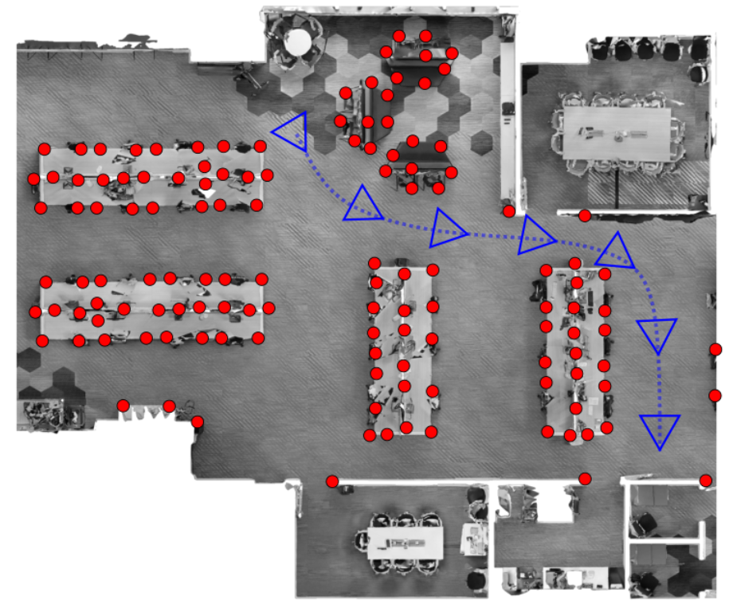
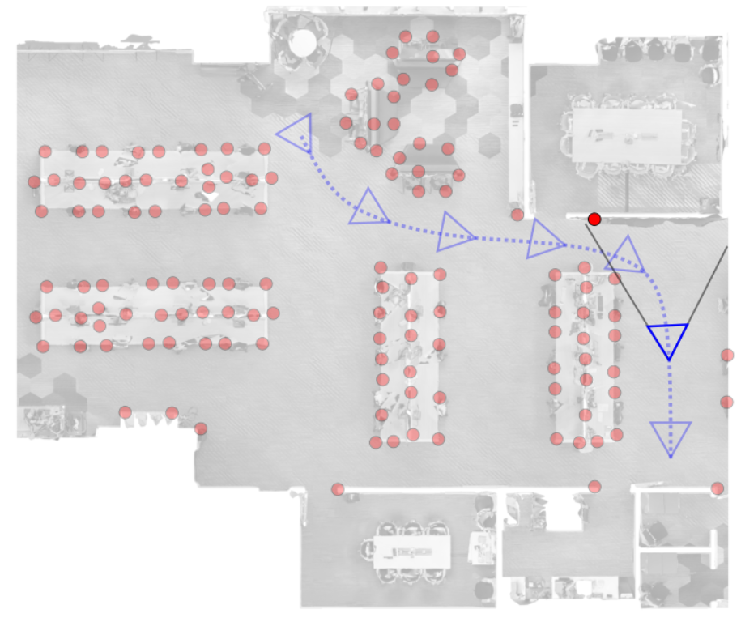
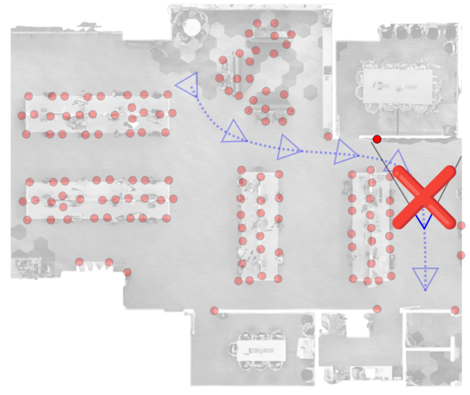

# Active Localization Benchmark

Active localization is the task of determining the most informative viewpoints to improve a robot’s pose estimation within a known map. Traditionally, a robot navigating an environment may rely on passive localization—simply pointing its camera forward while moving. However, this ignores the fact that not all viewpoints are equally informative. Consider a scenario where the robot faces a featureless white wall: looking straight ahead in this case offers little to no localization cues.

<!-- <p align="center">
  
  
  
</p> -->

Active localization instead aims to reason about the environment and proactively select viewpoints that maximize perceptual information, improving robustness and accuracy, especially in ambiguous or textureless areas. Heuristics in where to look can be achieved through optimality criteria and Fisher information matrices, visibility, distribution of landmarks, or deep learned techniques. 

### Important submission information
Before going through this repo, we assumed you have read important information about submission [activep-ws.github.io/challenge](https://activep-ws.github.io/challenge.html)


<!-- <p align="center">
  
</p> -->

## How to Actively Localize?
The workflow is simple, you can start from any of the inputs: SfM reconstruction, mesh, and semantics image. The only **mandatory** thing is the waypoints, 3D locations (x, y, z) from which you want to provide the "best" viewing angles:

```
input: any <SfM model, mesh, semantics, etc..> + 3D waypoints (mandatory)
         ↓
    inference.py
         ↓
    best viewing angles (we assume for each 3D location you produce an orientation in the form of a quaternion)
```

This repository provides some utilities to help you develop your own pipeline for predicting camera viewing directions at given waypoints in 3D scenes.

## Environment Setup
Once you clone the repo, make sure you clone its submodules. The localization accuracy calculation is based on [hloc](https://github.com/cvg/Hierarchical-Localization), hence it requires some features and matchers locally. Either you clone with flag `--recursive` or you clone and update the submodules this way:
```bash
git submodule update --init --recursive
```
Create conda environment:
```bash
conda create -n actloc_benchmark  python=3.11 && conda activate actloc_benchmark
```
and install
```bash
pip install -r requirements.txt && pip install -e .
```

### Download some sample data

Download sample data, which consists of a sample mesh `.glb` and an SfM model with cameras, points, and images:
```bash
chmod +x download_sample_data.sh && ./download_sample_data.sh
```

## Overview
The pipeline consists of four main components:

1. **`inference.py`** - Predicts best viewing angles for each waypoint (this is where you should put your hands for the challenge),
Here, you need to output the orientations. 
2. **`capture_images_at_best_viewing_directions.py`** - Captures images at the predicted best orientations, which is required to evaluate the localization accuracy.
3. **`match_and_localize.py`** - Given poses and their corresponding images from steps (1) and (2), you want to match and localize against the SfM model. For this purpose, we employ [hloc](https://github.com/cvg/Hierarchical-Localization). For each image localized, you will have an error.
4. **`evaluate.py`** - Given the errors from localization, this outputs the localization score according to [learning-where-to-look](https://link.springer.com/chapter/10.1007/978-3-031-73016-0_12).

We now explain how each module works and what the I/O is through a practical example.

### To work with a specific scene, navigate to its data folder:
```bash
cd actloc_benchmark/example_data/00010-DBjEcHFg4oq/
```

### `inference.py`
Predict the best viewing angles for your waypoints (here is where you should put your hands). For now, the best angles heuristic is simply based on maximizing the visibility of 3d landmarks. The script's output full estimate pose (waypoint + orientation) in COLMAP style:
```bash
python ../../inference.py \
    --waypoints-file sampled_waypoints.txt \
    --sfm-dir scene_reconstruction \
    --output-estimate estimate/selected_gt_poses.txt
```
**Note:**  Use `sampled_waypoints_mini.txt` for faster results. The test set will have a similar density to `sampled_waypoints.txt`.

### `capture_images_at_best_viewing_directions.py`
Capture images corresponding to previously estimated poses:
```bash
python ../../capture_images_at_best_viewing_directions.py \
    --pose-file ../00010-DBjEcHFg4oq/estimate/selected_gt_poses.txt \
    --mesh-file DBjEcHFg4oq.glb \
    --output-folder estimate/images
```

### `match_and_localize.py`
```bash
python ../../match_and_localize.py \
    --sfm_model_path scene_reconstruction \
    --ref_images_path scene_reconstruction/images \
    --ref_features_fn scene_reconstruction/sfm_features.h5 \
    --query_images_path estimate/images \
    --poses_fn estimate/selected_gt_poses.txt \
    --output_path estimate
```

### `vis.py`
Script to visualize the scene mesh, waypoints, ground truth poses, and estimated poses:
```bash
python ../../vis.py \
    --meshfile DBjEcHFg4oq.glb \
    --gt_poses estimate/selected_gt_poses.txt \
    --es_poses estimate/estimate_poses.txt\
    --waypoints sampled_waypoints.txt
```

> [!TIP]
> Make sure you don't have roll-rotation around the z-optical axis in your "best viewpoints" images.


### `evaluate_loc.py`
```bash
python ../../evaluate_loc.py --error-file estimate/pose_errors.txt
```
Note that evaluation for single viewpoint localization is based on accuracy intervals. If you want to calculate the accuracy among multiple scenes, it is enough to concatenate each `error-file` into a single file and input this to `evaluate_loc.py`. Do not average results, it is not the correct way!

### `evaluate_plan.py`

[Work in Progress]: The evaluation of viewpoint selection for multiple waypoints of a given path is also mainly based on the accuracy intervals, but also consider the viewpoint rotational continuity between consecutive waypoints. This is important for the robot to avoid abrupt changes in orientation. 


## Data provided

### File formats and explanation
Here we explain only file formats and what data we provide you as a sample:

- **SfM Reconstruction**: HLOC/COLMAP reconstruction folder containing:
  - `cameras.bin/txt` - Camera intrinsics
  - `images.bin/txt` - Camera poses and image/features information
  - `points3D.bin/txt` - 3D point cloud with colors
  - `database.db` - SQLite file storing keypoints, descriptors, and matches used for SfM
  - `sfm_features.h5` - HDF5 file with local features (keypoints and descriptors) for SfM images
- **Waypoints File**: Text file with 3D coordinates (N×3 format)
  ```
  (id1) x1 y1 z1
  (id2) x2 y2 z2
  ...
  ```
- **Mesh File**: 3D scene mesh (`.glb`, etc.)

### Example Data
We provide one [example scene](https://drive.google.com/file/d/1cL7FuSUetKux2LWOlD9sRpUi4NX1pRvr/view?usp=sharing).

### Full Dataset 
We provide you with a sample dataset including 90 meshes and their SfM model that you can use for training or testing the robustness of your approach. You can download data from [here](https://drive.google.com/file/d/1oXVfOb-0t9x9QRCUPdG8j7QqbeW_TPRu/view?usp=sharing). This contains more scene folders similar to the sample data:

```
formatted_training_data
├── <scene_1>
│   ├── scene_reconstruction
│   │   ├── images/ # Images for SfM
│   │   ├── cameras.bin
│   │   ├── images.bin
│   │   ├── points3D.bin
│   │   ├── database.db
│   │   └── sfm_features.h5
│   ├── waypoints.txt # The coordinates of some waypoints sampled from the free space in the scene
│   └── <scene_1>.glb
├── <scene_2>  
│   └── ...   
└── ...
```


### Full Dataset with Viewpoints
In addition, we provide some data that you could potentially employ for training. This already contains, for each sampled waypoint, potential camera orientations and the captured images. So basically, the full pre-process is ready for you. Bear in mind that this has been collected at the following orientation resolution:
- **elevation-axis**: 6 intervals covering [-60°, +40°] with 20° steps
- **azimuthal-axis**: 18 intervals covering [-180°, +160°] with 20° steps

You can download it from [here](https://drive.google.com/file/d/1OpvCGehuhU3WS9Ew54BCGocbzn17447G/view?usp=sharing) and it is organized as follows:
```
training_data
├── raw_images
│   ├── <scene_1>
│   │   ├── scene_reconstruction
│   │   │   ├── images/ # Images for SfM
│   │   │   ├── img_nm_to_colmap_cam.txt
│   │   │   └── img_name_to_colmap_Tcw.txt
│   │   ├── waypoint_1
│   │   │   ├── images/ # Images for Localization at waypoint 1
│   │   │   ├── img_nm_to_colmap_cam.txt
│   │   │   └── img_name_to_colmap_Tcw.txt
│   │   ├── waypoint_2
│   │   │   └── ...
│   │   ├── <scene_1>.glb
│   │   ├── sampled_waypoints.txt # The coordinates of all sampled waypoints in the free space of the scene
│   │   └── ...
│   ├── <scene_2>
│   │   └── ...
│   └── ...
└── sfm_and_localization_results
    ├── <scene_1>
    │   ├── scene_reconstruction
    │   │   ├── cameras.bin
    │   │   ├── images.bin
    │   │   ├── points3D.bin
    │   │   ├── database.db
    |   |   └── sfm_features.h5
    │   ├── waypoint_1
    │   │   ├── results.txt
    │   │   └── pose_errors.txt
    │   ├── waypoint_2
    │   │   └── …
    │   └── ...
    ├── <scene_2>
    │   └── ...
    └── ...
```

Note the camera intrinsics and extrinsics for each image are stored in two files using the [COLMAP output format](https://colmap.github.io/format.html).

- `img_nm_to_colmap_cam.txt`: This file stores the **intrinsic parameters** for each image. Each line contains the image filename, the camera model (always `PINHOLE`), followed by the image width and height, focal lengths (`fx`, `fy`), and the principal point (`cx`, `cy`). These parameters define how 3D points are projected onto the 2D image plane.

- `img_name_to_colmap_Tcw.txt`: This file stores the **extrinsic parameters** for each image, representing the camera pose as a transformation from world coordinates to camera coordinates (Tcw). Each line contains the image filename, followed by a unit quaternion (`qw qx qy qz`) representing rotation and a 3D vector (`tx ty tz`) for translation.

Estimated camera poses and their evaluation are stored in two plain-text files.

- `results.txt`: This file stores the **estimated camera poses** for each query image. Each line contains the image filename, followed by a unit quaternion (`qw`, `qx`, `qy`, `qz`) and a translation vector (`tx`, `ty`, `tz`) that convert world coordinates to camera coordinates (`Tcw`).

- `pose_errors.txt`: This file stores the **pose errors** for each image. The first line is a header `# image_name trans_e_m rot_e_deg`. Each following line contains the image filename, the translation error (`trans_e_m`, Euclidean distance in metres between estimated and ground-truth camera centres) and the rotation error (`rot_e_deg`, smallest angle in degrees between the two orientations).

